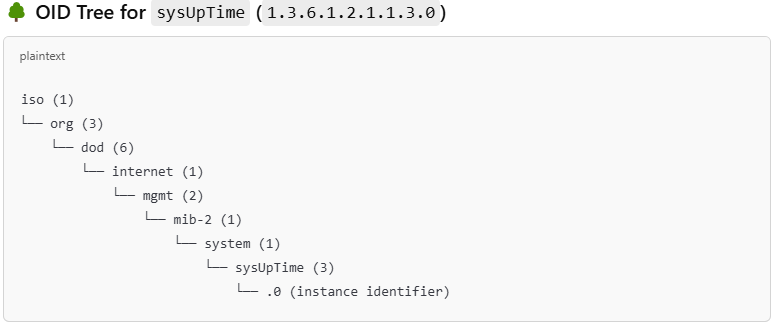
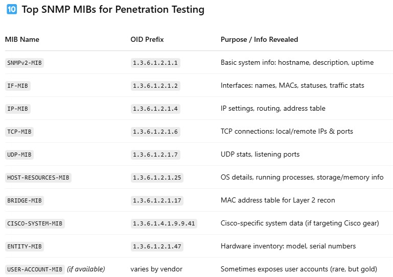

***Information***
* **SNMP** runs on UDP so (being stateless) us susceptable to *IP SPOOFING* and *REPLAY* attacks.
* SNMP when unencrypted can have credentials intercepted

SNMP **MIBs** (Management Information Bases) are databases of hierarchical information used by SNMP to manage devices on a network.

**MIBs** act like dictionaries that define what data SNMP can request or set on network devices. They are structured as hierarchical trees, where each piece of information is identified by a unique OID that maps to a specific parameter, like system uptime or interface status.

* * *

* * *
**nmap**

1. Scan for open SNMP ports:
`nmap -sU --open -p 161 x.x.x.1-254 -oG open-snmp.txt`

* * *
**onesixtyone**
1. Create a wordlist for SNMP community strings:
`echo public > community`
`echo private >> community`
`echo management >> community`

2. Scan IPs for SNMP:
`for ip in $(seq 1 254); do echo x.x.x.$ip; done > ips`

3. Scan SNMP communities:
`onesixtyone -c community -i ips`
`onesixtyone -c common-snmp-community-strings-onesixtyone.txt <target> -w 100`

4. Enumerate with **onesixtyone**  
`onesixtyone <targetIP> public`  
`onesixtyone -c /usr/share/wordlists/seclists/Discovery/SNMP/snmp-onesixtyone.txt <targetIP>`

5. Enumerate with **snmp-check**  
`snmp-check -c public <targetIP>`

6. Enumerate with **snmpwalk**  
`snmpwalk -v2c -c public <targetIP>`

* * *
**snmpwalk** 
`snmpwalk -c public -v1 -t <target>`

Use **MIBs** to get specific information

Enumerate users on DC target:
`snmpwalk -c public -v1 <target> 1.3.6.1.4.1.77.1.2.25`

Enumerate running processes:
`snmpwalk -c public -v1 <target> 1.3.6.1.2.1.25.4.2.1.2`

Show all the software installed:
`snmpwalk -c public -v1 <target> 1.3.6.1.2.1.25.6.3.1.2`

Show all TCP LISTENING ports:
`snmpwalk -c public -v1 <target> 1.3.6.1.2.1.6.13.1.3`

Enumerate extended objects:
`snmpwalk -v1 -c public <target> NET-SNMP-EXTEND-MIB::nsExtendObjects`

**snmpbulkwalk** 
Simple walk
`snmpbulkwalk -c public -v2c <target> > out.txt`

