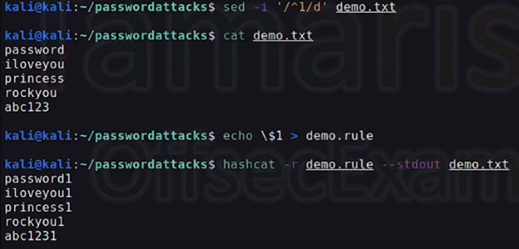
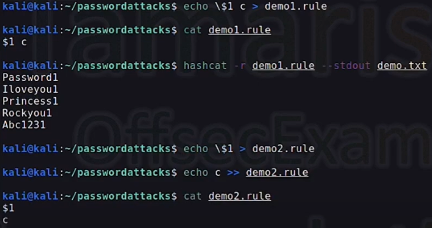
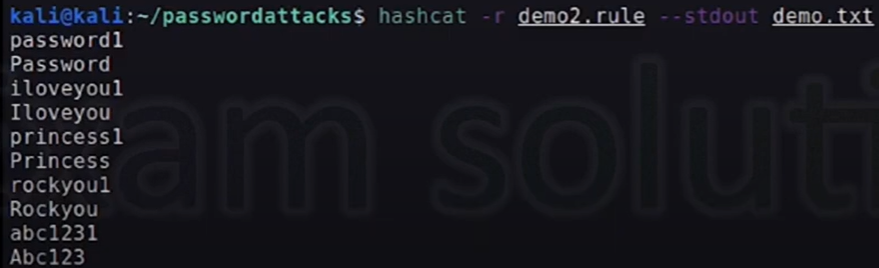
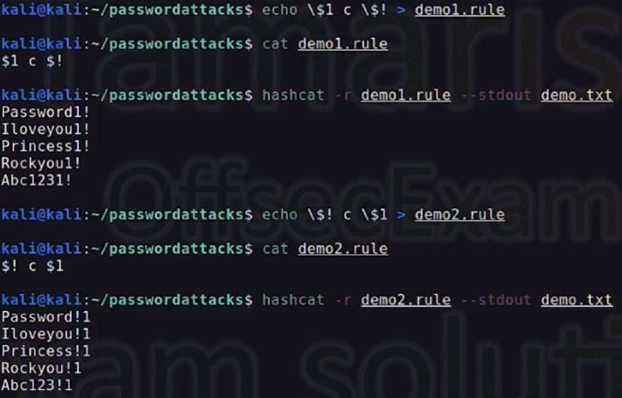

# Mutating wordlists

### Using Rule files with Hashcat

Create rules, or use predefined hashcat rule located at:  
`/usr/share/hashcat/rules`




* * *

Create rules that must match passwords in a wordlist.

**Example wordlist:**
Window
rickc137
dave
superdave
megadave
umbrella

**Password Policy:**
- 3 numbers
- A caplital letter
- A special character

**ssh.rule** file
- Use **c** for Capitalization of the first letter
- Use 1 3 7 for the numerical values
- Append different special characters (**!**, **@**, **#**)
```
c $1 $3 $7 $!
c $1 $3 $7 $@
c $1 $3 $7 $#
```
* * *
**Run hashcat with rule**
`hashcat -m 22921 <hash_file> <password_list> -r ssh.rule --force`

**Note**: If you get an error "**Token length exception**", it's becuase **22921** doesn't support **aes-256-ctr** -- Then use **JohntheRipper**

* * * 
### Cracking SAM NTLM hashes
1. Copy NTLM hash to file **sam.hash**
2. Check the cipher used `hashcat --help | grep -i "ntlm"`
3. Using 1000 for NTLM Operating System 
`hashcat -m 1000 sam.hash /usr/share/wordlists/rockyou.txt -r /usr/share/hashcat/rules/best64.rule --force`

### Cracking NetNTLMv2 hashes
1. Copy NetNTLMv2 has to **file.hash**
2. Check the cipher used `hashcat --help | grep -i "ntlm"`
3. Using 5600 for NetNTLMv2
`hashcat -m 5600 file.hash /usr/share/wordlists/rockyou.txt --force`