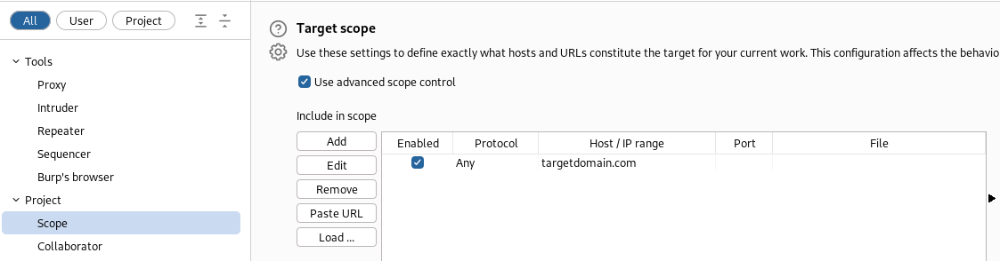

### Burpsuite
1. Go to **Target** , **Scope Settings** , **Target Scope** and enable **Use advanced scope control**
2. **Add** > **Protocol=Any** and **Host/IP** range as target domain.

3. Go to **Proxy** , **Proxy Settings** , **Tools** , **Proxy** and under **Request interception rules** & **Response interception rules** Enable **And | URL | Is in target scope**
4. Turn **Proxy** **Intercept** to **On**
5. Capture a Login payload and Send to **Repeater** and **Intruder**, **Forward** the original login payload and find a value to match for a grep filter
6. Go to **Intruder** , **Settings** , **Grep Match**, clear the list and Add Error value to filter with.
7. Configure a Sniper attack on the password payload
8. 