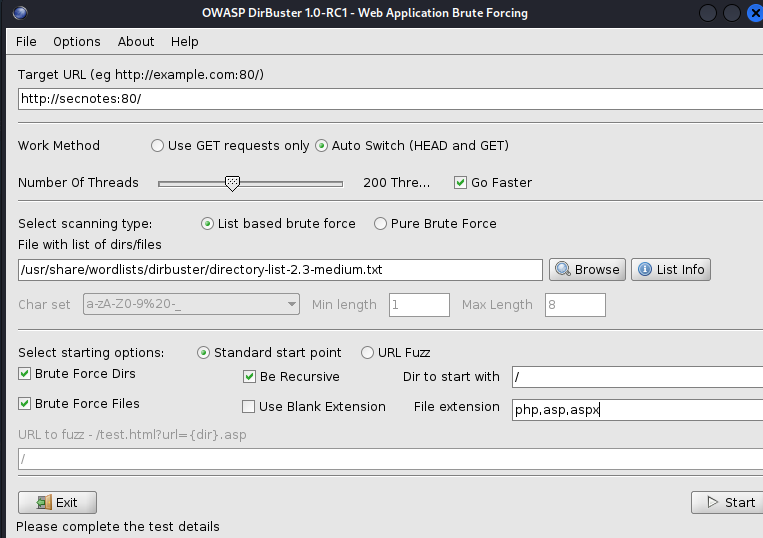

## HTTP/S

1.  `nmap -p80,443 --script=vuln <target IP>`
2.  Enumerate sub-directories

### dirsearch

`dirsearch -u http://<target>`

### dirbuster

`dirbuster&`  
Use wordlist:  
`/usr/share/wordlists/dirbuster/directory-list-lowercase-2.3-medium.txt`

### gobuster

`gobuster dir -t 4 -w /usr/share/wordlists/dirbuster/directory-list-lowercase-2.3-medium.txt -u http://<targetIP> -x .php`

### ffuf

`ffuf -w wordlist.txt -w http://website.com/FUZZ -e .aspx,.html -mc 200,302`

### Subdomain busting

`ffuf -w /usr/share/seclists/Discovery/DNS/n0kovo_subdomains.txt -u http://cozyhosting.htb/ -H "HOST: FUZZ.cozyhosting.htb" -mc 200,301,403 -t 200` , then `-fw` to filter out the word count

5. check html pagesource for any info  
6. `nikto -h http://<target>`  
7. `dirbuster&`  
  
8. `dirb`  
9. `gobuster`  
10. Enumerate web pages looking for vulnerable software exploits
11. Check for XSS vulnerabilities  
12. Check for SQLi vulnerabilities  
13. Check for FileUpload vulnerabilities  
14. Once Logged in, check folder and files  
`/var/www/html`