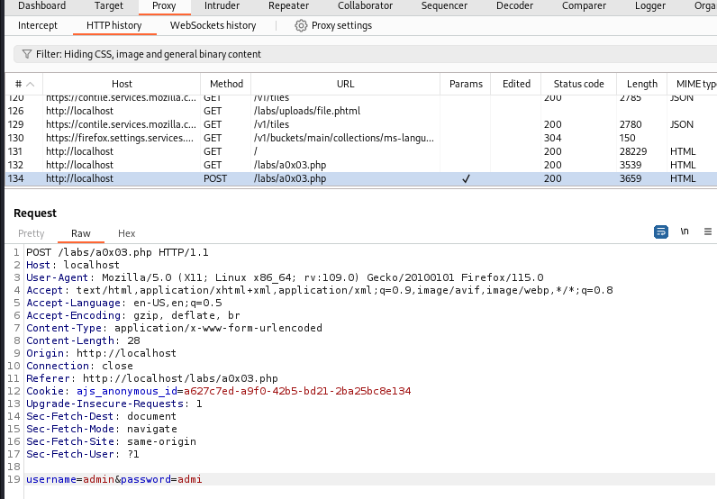
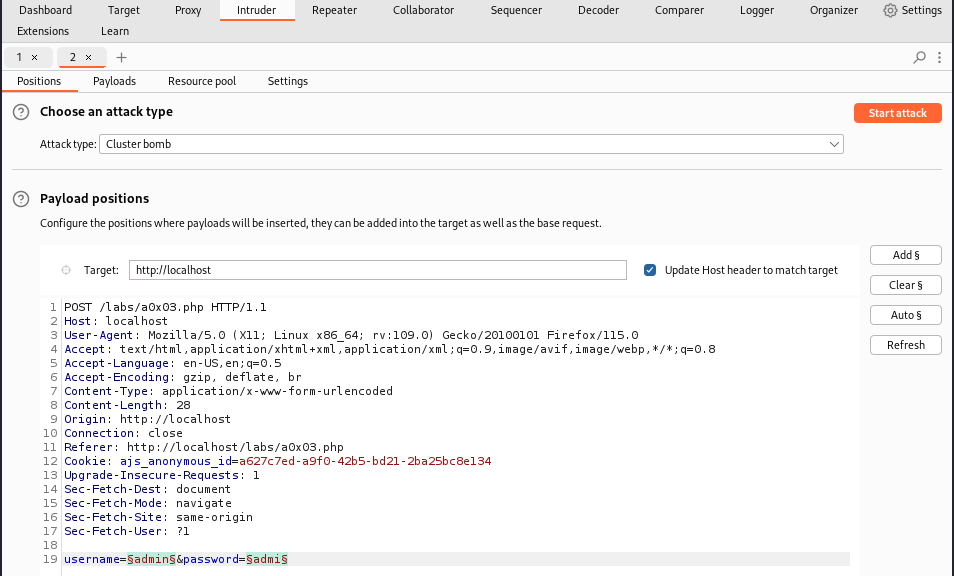
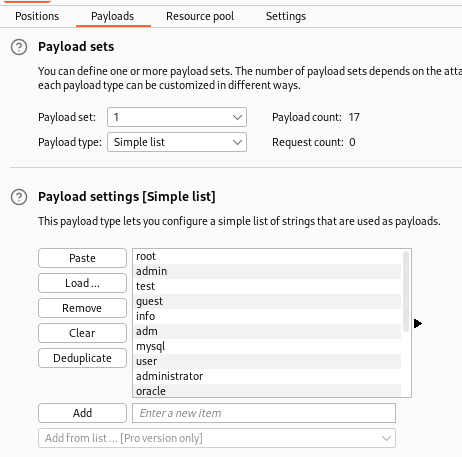

# BurpSuite
1 Locate authentication payload in HTTP history and Send to Intruder

2. Select the username and Insert a payload marker. Select the password and Insert a payload Marker

3. Set Attack Type to **Cluster bomb**
4. Select the **Payload** tab. 
For Payload set 1, load your username list
For Payload set 2, load your password list

5. Click **Start Attack**