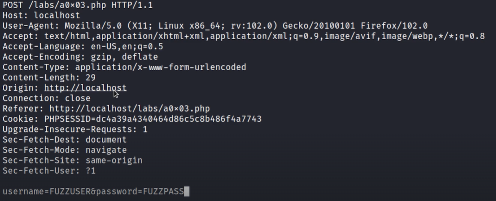

# FFUF

1. Grab a copy of the payload sent to authentication and add to file **payload.txt**

2. Change the username and password values to respective keywords **FUZZUSER** and **FUZZPASS**
3. `ffuf -request payload.txt -request-proto http -mode clusterbomb -w <password_list>:FUZZPASS -w <username_list>:FUZZUSER -fs <content-length to filter>`
